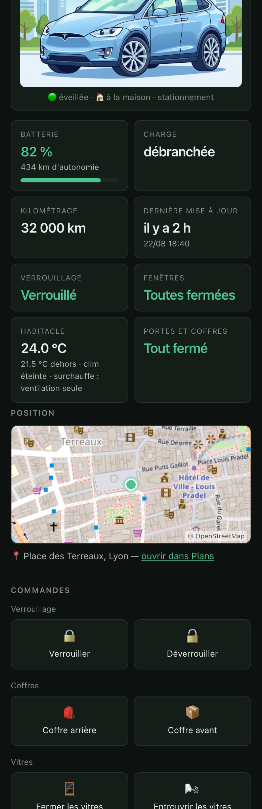
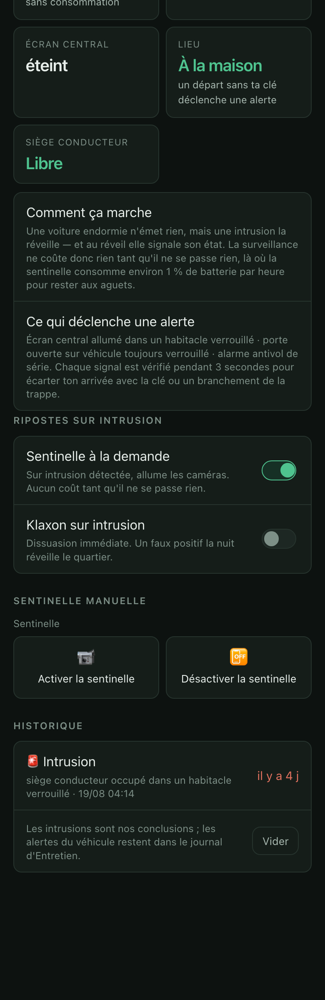
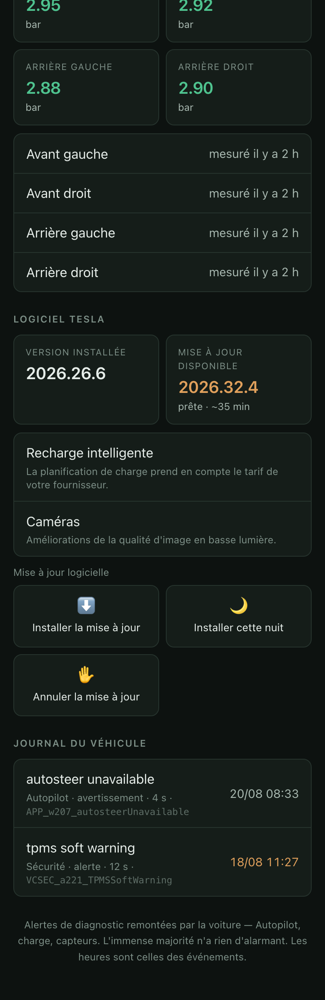
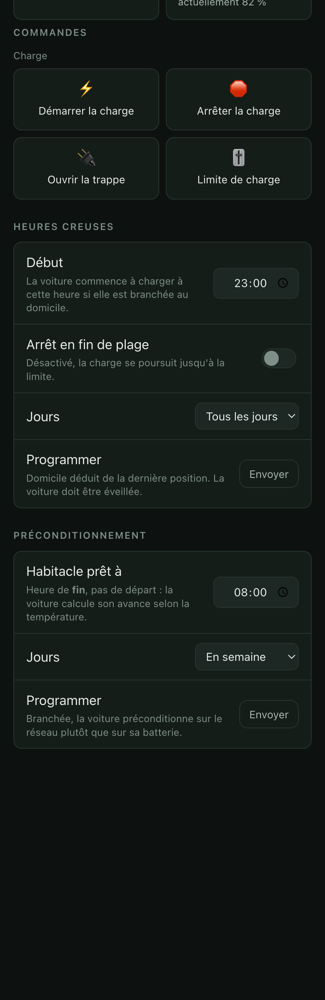
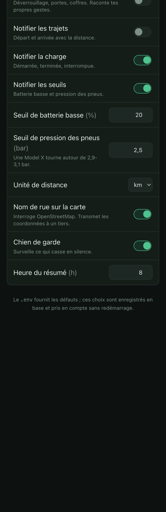
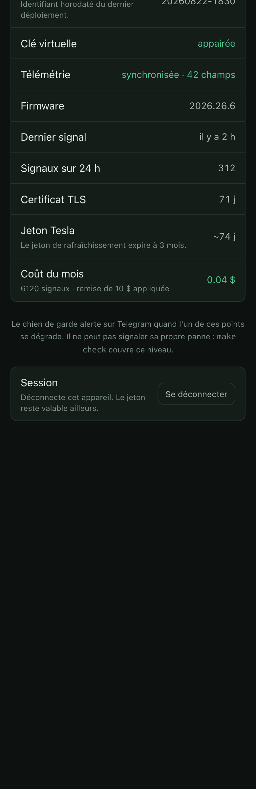

# CyberTinix

> Projet personnel, publié tel quel. Non affilié à Tesla. Il agit sur un
> véhicule réel : lis la section « Sécurité sans sentinelle » avant d'activer
> la moindre riposte, et garde-les désactivées tant que tu n'as pas observé
> une semaine sans fausse alerte.


Sécurité, suivi et pilotage d'une Tesla Model X via l'API Fleet officielle,
auto-hébergé.

L'objectif de départ : **protéger le véhicule sans le mode Sentinelle**, qui
maintient la voiture éveillée en permanence pour environ 1 % de batterie par
heure. Le principe retenu — une voiture endormie n'émet rien, mais une
intrusion la réveille, et au réveil elle rapporte son état — ne coûte rien
tant qu'il ne se passe rien. Voir « Sécurité sans sentinelle ».

Autour de ce cœur : notifications Telegram (charge, seuils, trajets), une
interface web pensée pour le téléphone, une supervision qui détecte les pannes
silencieuses, et les planifications natives du véhicule.

Le retour d'expérience de la mise en service — ce que la documentation Tesla
ne dit pas assez fort — est dans la section « Pièges connus » en fin de page.

## Aperçu

Interface sur téléphone, six onglets. Captures réalisées sur une maquette
avec des données fictives.

<p align="center">
  
  
  
</p>
<p align="center">
  
  
  
</p>

## Architecture

```
Model X ──websocket mTLS──> fleet-telemetry ──MQTT──> app ──> Telegram
                                                       │
                                                       ├──> PostgreSQL
                                                       ├──> interface web (/)
                                                       └──> tesla-http-proxy ──> Fleet API
```

| Service | Rôle | Origine |
|---|---|---|
| `nginx` | Aiguillage TCP par SNI sur le 443, `.well-known`, reverse proxy | config maison |
| `fleet-telemetry` | Reçoit le flux du véhicule, republie sur MQTT | Tesla |
| `mosquitto` | Broker interne | — |
| `tesla-http-proxy` | Signe les commandes avec la clé privée | Tesla |
| `postgres` | Persistance | — |
| `app` | OAuth, ingestion, règles, sécurité, supervision, interface | **le seul code à écrire** |
| `certbot` | Renouvellement TLS | — |

### Modules de `app/cybertinix`

| Module | Rôle |
|---|---|
| `ingest.py` | Consomme MQTT, persiste, dédoublonne les alertes, déclenche les règles |
| `rules.py` | Règles de notification : transitions, seuils verrouillés, trajets |
| `security.py` | Détection d'intrusion avec corrélation temporelle, ripostes |
| `enums.py` | Traduction des énumérations Tesla (préfixées) et conversion miles → km |
| `alerts.py` | Décodage des alertes véhicule, filtre sécurité sur le calculateur VCSEC |
| `telemetry.py` | Configuration de télémétrie envoyée au véhicule (42 champs) |
| `actions.py` | Liste blanche des commandes exposées à l'interface |
| `prefs.py` | Réglages modifiables à chaud, le `.env` ne fournissant que les défauts |
| `status.py` | État consolidé, valeurs live traduites, connectivité |
| `watchdog.py` | Chien de garde et résumé quotidien |
| `commands.py` | Écoute Telegram, filtrée sur le seul `chat_id` autorisé |
| `charging.py` | Planifications de charge et de préconditionnement |
| `geocode.py` | Nom de rue via Nominatim, avec cache |
| `auth.py` | Jeton partagé sur toutes les routes sauf `/healthz` et le callback |
| `web/index.html` | L'interface, page unique, six onglets |
| `web/modelx-*.jpg` | Illustrations du véhicule, fermé et portes Falcon ouvertes — servies sous `/static` |

Les illustrations sont des dessins génériques ; remplace-les par les tiennes dans
`app/cybertinix/web/` en gardant les noms de fichiers.

### Pourquoi nginx en mode `stream`

`fleet-telemetry` doit terminer le mTLS lui-même : aucun proxy ne peut
déchiffrer sa connexion. Or le `.well-known/` et le callback OAuth ont eux
aussi besoin du 443. nginx fait donc du **passthrough TCP** en aiguillant sur le
nom SNI — `telemetry.<domaine>` vers la télémétrie, le reste vers l'app.

Le routage se fait par motif (`~^telemetry\.`), pas sur un domaine en dur :
rien à modifier dans nginx quand le domaine sera choisi.

## Prérequis

- Un VPS exposé sur Internet (l'auto-hébergement derrière une box échoue
  généralement à cause du CGNAT — la voiture doit pouvoir t'atteindre)
- Un nom de domaine, avec `A`/`AAAA` sur le VPS pour `<domaine>` **et**
  `telemetry.<domaine>`
- Docker + Docker Compose
- Une application validée sur developer.tesla.com (`client_id` / `client_secret`)

## Mise en route

```bash
cp .env.example .env   # puis compléter
make keys              # paire de clés prime256v1 de l'application
make proxy-cert        # certificat interne du proxy
make certs             # Let's Encrypt (DNS déjà propagé)
make register          # enregistrement partenaire auprès de Tesla
make up
```

Puis, dans l'ordre :

1. Ouvrir `https://<domaine>/auth/login` → autoriser le compte Tesla
2. Suivre le lien d'appairage affiché, **depuis l'iPhone, près du véhicule**
3. `GET /vehicles` pour récupérer le VIN
4. `GET /vehicles/<vin>/status` → vérifier `vehicle_command_protocol_required`
   et l'éligibilité à la télémétrie
5. Pousser une configuration de télémétrie via le proxy *(à implémenter)*

## Configurer la télémétrie

Une fois la clé virtuelle appairée :

```
POST   /vehicles/{vin}/telemetry          configure (défauts, ou surcharges en JSON)
GET    /vehicles/{vin}/telemetry          état — attendre "synced": true
GET    /vehicles/{vin}/telemetry/errors   erreurs remontées par le véhicule
DELETE /vehicles/{vin}/telemetry          retire la configuration
```

La configuration part par le proxy, qui la signe avec la clé privée. Le jeu de
champs par défaut est dans `telemetry.py` — 14 champs, environ 0,006 $ par
heure de conduite.

`POST` répond `200` même en cas de refus : lire `skipped`. Les motifs sont
`missing_key` (clé virtuelle absente), `unsupported_hardware`,
`unsupported_firmware` et `max_configs`.

La chaîne de certification envoyée au véhicule est
`/etc/letsencrypt/live/teslaaddict/chain.pem`, soit l'intermédiaire Let's
Encrypt. Si le véhicule remonte une erreur `bad certificate`, pointer
`TELEMETRY_CA_PATH` vers une chaîne incluant aussi la racine ISRG.

## Interface

`https://<domaine>/` — page unique, pensée pour le téléphone. Elle affiche
l'état du véhicule, exécute les commandes, règle les seuils et programme la
charge en heures creuses.

L'état vient de la base, pas de l'API : gratuit, instantané, et sans réveiller
la voiture. Les valeurs datent donc du dernier changement remonté par la
télémétrie — une voiture endormie garde l'état qu'elle avait en s'endormant.

Les **réglages** sont modifiables à chaud : le `.env` fournit les défauts,
l'interface écrit des écarts en base (`prefs.py`), et les boucles de
supervision les relisent à chaque tour. Pas de redémarrage.

Les **commandes** passent par une liste blanche (`actions.py`). Fleet API en
expose une soixantaine, dont l'effacement des données utilisateur et la gestion
des codes PIN : seules celles qui sont utiles au quotidien et sans conséquence
irréversible sont exposées.

## Authentification

Toutes les routes exigent `API_TOKEN`, sauf `/healthz` (sondé par `make check`)
et `/auth/callback` (où Tesla redirige sans pouvoir porter notre jeton — il est
protégé par le `state`, que seul `/auth/login` sait émettre).

`/auth/login` est protégé délibérément : sans cela, un tiers pourrait dérouler
le flux OAuth avec son propre compte Tesla et écraser le jeton enregistré,
l'application n'en conservant qu'un.

```bash
curl -H "Authorization: Bearer $API_TOKEN" https://<domaine>/status
```

Depuis le VPS, le jeton se lit dans le `.env` sans le recopier nulle part :

```bash
curl -H "Authorization: Bearer $(grep '^API_TOKEN=' .env | cut -d= -f2)" https://<domaine>/status
```

C'est le cas typique après un déploiement qui ajoute des champs de télémétrie —
il faut republier la configuration avec `POST /vehicles/<vin>/telemetry`.

Dans un navigateur, `/login` présente un vrai formulaire : identifiant fixe
`cybertinix`, jeton en mot de passe. iOS et les gestionnaires de mots de passe
proposent de l'enregistrer — ce que l'invite HTTP Basic, utilisée au début, ne
permettait pas. Le formulaire pose un cookie de session valable un an, qui
contient un dérivé HMAC du jeton et non le jeton lui-même. `/logout` le retire.
Changer `API_TOKEN` invalide toutes les sessions d'un coup.

## Identifiants d'infrastructure

Le projet s'appelle CyberTinix, mais plusieurs identifiants internes restent
`teslaaddict` : le nom du projet Compose (qui nomme les volumes où vivent les
certificats et la base), l'utilisateur et la base PostgreSQL, le lien
`/etc/letsencrypt/live/teslaaddict`, le dossier de déploiement sur le VPS.

Les renommer orphelinerait les volumes existants — au redémarrage, Docker en
créerait de nouveaux, vides. C'est faisable avec une migration, mais ça
n'apporte rien à l'usage. On ne les touche pas.

Sans `API_TOKEN`, l'application refuse de servir les routes protégées plutôt que
de les ouvrir. Le domaine figure en clair dans les journaux de transparence des
certificats : il ne protège rien.

## Sécurité sans sentinelle

C'est l'objectif d'origine du projet. Le mode Sentinelle maintient la voiture
éveillée en permanence, caméras allumées, pour environ 1 % de batterie par
heure. On s'en passe.

**Le principe** : une voiture endormie n'émet rien — mais une intrusion la
réveille. Forcer une porte, toucher l'écran, s'asseoir dans l'habitacle : la
voiture sort de son sommeil, le client télémétrie se reconnecte et pousse son
état. Ce n'est pas le serveur qui surveille, c'est l'effraction elle-même qui
déclenche le rapport. Coût tant qu'il ne se passe rien : zéro.

**Le signal décisif** est `CenterDisplay` passant à `Lock` : l'écran central
s'allume en affichant le cadenas, ce qui n'arrive que si quelqu'un se trouve
dans un habitacle verrouillé. Deux causes innocentes produisent le même signal
et sont écartées par corrélation temporelle — une porte ouverte avec la clé
dans les 4 s, la trappe de charge dans les 5 s. L'alerte est différée de 3 s
pour laisser le temps à ces explications d'arriver. Logique reprise de
SentryGuard après lecture de son code (`security.py`).

Cinq détecteurs : **siège conducteur occupé** dans un habitacle verrouillé (le
plus direct — pas d'explication innocente), écran allumé dans un habitacle
verrouillé, porte ouverte sur véhicule toujours verrouillé, alarme antivol de
série (via les alertes `customer`), et **départ du domicile sans déverrouillage
par la clé** — remorquage ou vol, signalé sans riposte (klaxonner une voiture
sur une dépanneuse n'apporte rien). Le véhicule sait lui-même s'il est chez toi
grâce au champ `LocatedAtHome`.

**Le signal qui innocente vraiment est le déverrouillage par la clé.** Avec la
clé téléphone, un Model X se déverrouille à l'approche du propriétaire, plusieurs
secondes avant l'ouverture de la porte — et c'est à ce réveil que l'écran
rapporte son état « verrouillé ». La première version corrélait sur la porte
seule, à 4 s : elle a fait klaxonner la voiture sur son propriétaire. Désormais
un `Locked: true → false` dans les 30 s écarte l'alerte, et toute riposte
revérifie le verrouillage juste avant d'agir. Un voleur ne produit pas ce
signal.

**Deux ripostes**, désactivées par défaut parce qu'elles agissent sur la
voiture, réglables depuis l'interface :

- *Sentinelle à la demande* — sur intrusion, `set_sentry_mode` allume les
  caméras. On a les images sans payer la surveillance les 99,9 % du temps où
  il ne se passe rien.
- *Klaxon* — dissuasion immédiate. Un faux positif la nuit réveille le quartier.

## Supervision

```
GET /status          état consolidé en JSON (?tesla=false pour rester local)
GET /status/texte    même chose, mise en forme
```

Sur Telegram, `/etat` renvoie la même synthèse. Seul le `chat_id` configuré est
servi : un identifiant de bot finit par circuler, et sans ce filtre n'importe
qui pourrait savoir où en est le véhicule.

Le **chien de garde** tourne toutes les 15 minutes et alerte sur : absence de
données au-delà de 48 h, clé virtuelle retirée, télémétrie désynchronisée,
erreurs remontées par le véhicule, certificat ou jeton proches de l'expiration.

Chaque contrôle est verrouillé sur son état — alerte à la bascule, silence tant
que le problème dure, message au rétablissement. Un contrôle qui répète la même
alerte toutes les quinze minutes finit par être ignoré, ce qui le rend inutile.

Un **résumé quotidien** part à 8 h locales (`DIGEST_HOUR`).

Les appels Tesla utilisés par la supervision (`fleet_status`, configuration et
erreurs de télémétrie) ne sont pas facturés et ne réveillent pas le véhicule.

## Charge en heures creuses

```
POST   /vehicles/{vin}/charge-schedule       programme une fenêtre
GET    /vehicles/{vin}/charge-schedule       liste (⚠️ facturé, réveille)
DELETE /vehicles/{vin}/charge-schedule/{id}  supprime
```

On utilise la planification **native** du véhicule plutôt que de piloter la
charge avec `charge_start` / `charge_stop`. Elle vit dans la voiture : une seule
commande, aucun coût récurrent, et elle continue de s'appliquer si ce serveur
s'arrête — un pilotage maison qui lance la charge à 22 h mais meurt avant 6 h
laisserait charger en heures pleines toute la nuit.

`lat`/`lon` sont obligatoires côté Tesla : la planification est liée à un lieu
et ne se déclenche qu'à proximité. Omis, ils sont déduits de la dernière
position remontée par la télémétrie — gratuit et sans réveiller le véhicule.

Un tarif à double plage se traduit par deux planifications.

## Préconditionnement

```
POST   /vehicles/{vin}/precondition-schedule
GET    /vehicles/{vin}/precondition-schedule       ⚠️ facturé, réveille
DELETE /vehicles/{vin}/precondition-schedule/{id}
```

`precondition_time` est l'heure à laquelle l'habitacle doit être **prêt**, pas
celle où le cycle démarre : la voiture calcule son avance selon la température
extérieure. Programmer 8:00 signifie « tempéré à 8:00 ».

Branchée, la voiture préconditionne sur le réseau plutôt que sur sa batterie —
d'où l'intérêt de caler l'heure cible sur la fin des heures creuses.

## Ce qui reste à faire

- [ ] Test réel de la détection d'intrusion : voiture verrouillée et endormie,
      entrer sans clé → alerte attendue ; entrer avec la clé → silence attendu
- [ ] Nom exact de l'alarme VCSEC — inconnu tant qu'elle ne s'est pas déclenchée,
      il apparaîtra dans le journal de l'onglet Entretien
- [ ] Sonde externe sur `/healthz` : le chien de garde vit dans un conteneur et
      ne peut pas signaler sa propre mort
- [ ] Épingler les versions (`fleet-telemetry` v0.9.4, `tesla-http-proxy` v0.4.1)
- [ ] Alembic dès que le schéma devra migrer avec des données en base

## Unités et énumérations — à lire avant de toucher aux règles

Les énumérations arrivent **préfixées du nom de leur type** :
`DetailedChargeStateCharging`, `ShiftStateP`, `WindowStateClosed`. Comparer à
`"Charging"` échoue en silence — c'est ce qui a empêché les notifications de
charge de fonctionner jusqu'à ce qu'on passe par `enums.py`. Les valeurs exactes
sont dans `protos/vehicle_data.proto` du dépôt fleet-telemetry.

`Odometer` et `EstBatteryRange` sont en **miles** à la source, quelle que soit
l'unité affichée dans la voiture. Conversion dans `enums.py`.

Les pressions TPMS sont en bar. Les horodatages `TpmsLastSeenPressureTime*`
sont faux d'après Tesla elle-même.

## Pièges connus

- **La clé privée ne se régénère pas.** La remplacer invalide toutes les clés
  virtuelles appairées et impose de refaire l'appairage physiquement.
- **Le refresh token est à usage unique**, expire à 3 mois, et un changement de
  mot de passe côté utilisateur invalide tout.
- **La clé publique doit rester servie en permanence** sur le domaine. Si elle
  disparaît, l'appairage casse.
- **Dépasser la limite de facturation supprime les configurations de télémétrie
  sans les restaurer.** Il faut tout reconfigurer à la main.
- **`wake_up` est l'appel le plus cher** (50 requêtes/$) et limité à 3/min.
  Vérifier la connectivité via la télémétrie avant d'y recourir.

## Licence

MIT. Non affilié à Tesla, Inc. Fleet API, Fleet Telemetry et le proxy de
commandes sont des projets de Tesla sous leurs propres licences.
